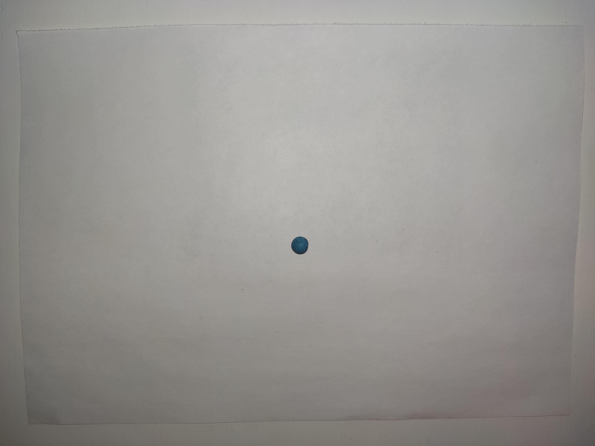

# Постановка задачи

На вход подается изображение, на котором расположены заранее известные предметы и начерченный на белом листе бумаги многоугольник. 

Необходимо расположить максимальное количество изображенных предметов в начерченный многоугольник. Если максимальное количество достигается с различным набором предметов, следует выбрать тот набор, на котором достигается наибольшая площадь покрытия начерченного многоугольника.

На выходе возвращается набор вмещенных предметов и отношение непокрытой площади многоугольника к площади всего многоугольника.

---

# Требования к входным данным

## Общие

 * Тень [почти] отсутствует
 * Высота съемки 40-60см над горизонтальной поверхностью
 * Камера отклоняется от нормали к горизонтальной поверхности не более чем на 5°
 * Все предметы полностью помещаются на изображении
 * Формат: .jpg
 * Разрешение: 4000x3000

## Изображения предметов

 * Расположен на белом листе A4 в центре
 * Лист лежит на горизонтальной поверхности, фон которой близок к белому
 * Лист помещается на изображении с краями
 * Предмет на листе единственен
 * Границы предмета четко различимы на белом листе A4

## Изображения предметов с многоугольником

 * Многоугольник замкнутый, может самопересекаться, невырожденный, > 2 вершин
 * Начерчен темным цветом на белой бумаге A5, толщина линии > 1мм в естественной плоскости
 * Многоугольник на листе единственен

<!-- -->

 * Предметы расположены так, чтобы между ними был виден фон
 * Предметы могут находится внутри, но не на другом предмете
 * Может быть несколько одинаковых предметов на одном изображении

<!-- -->

 * Лист с многоугольником и предметы должны не пересекаться

---

# Входные данные

## Предметы

 * Губка

    

 * Шпатель

    

 * Пуговица

    

 * Колпачок от ручки

    

 * Пластилиновый шарик

    

 * Шестиугольник

    

 * Симка

    

 * Резинка

    

 * Флешка

    

 * Колесо

    

 * Фон

    

## Примеры

 * 0 предметов

    

 * 1 помещающийся предмет

    

 * 1 непомещающийся предмет

    

 * 1 помещающийся из 2 предмет, выбрать максимальную площадь покрытия

    

 * 3 помещающихся предмета, вложенность предметов

    

 * 1 непомещающийся предмет, самопересеченность многоугольника

    

 * 8 помещающихся предметов, самопересеченность многоугольника

    

Другие тестовые данные можно найти в [imgs/input_data](imgs/input_data).

Разметка данных находится в [imgs/input_data/desc.pydict](imgs/input_data/desc.pydict). Формат разметки указан в комментариях (#) в самом файле.
