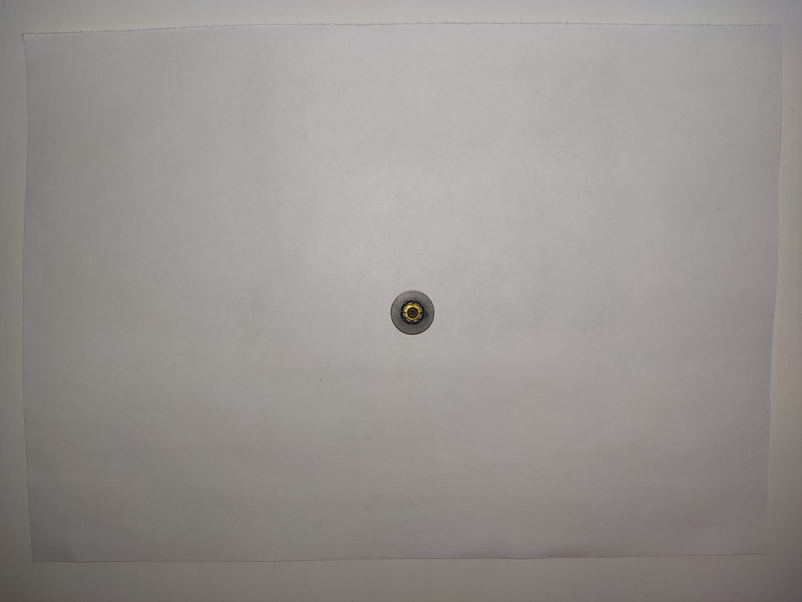
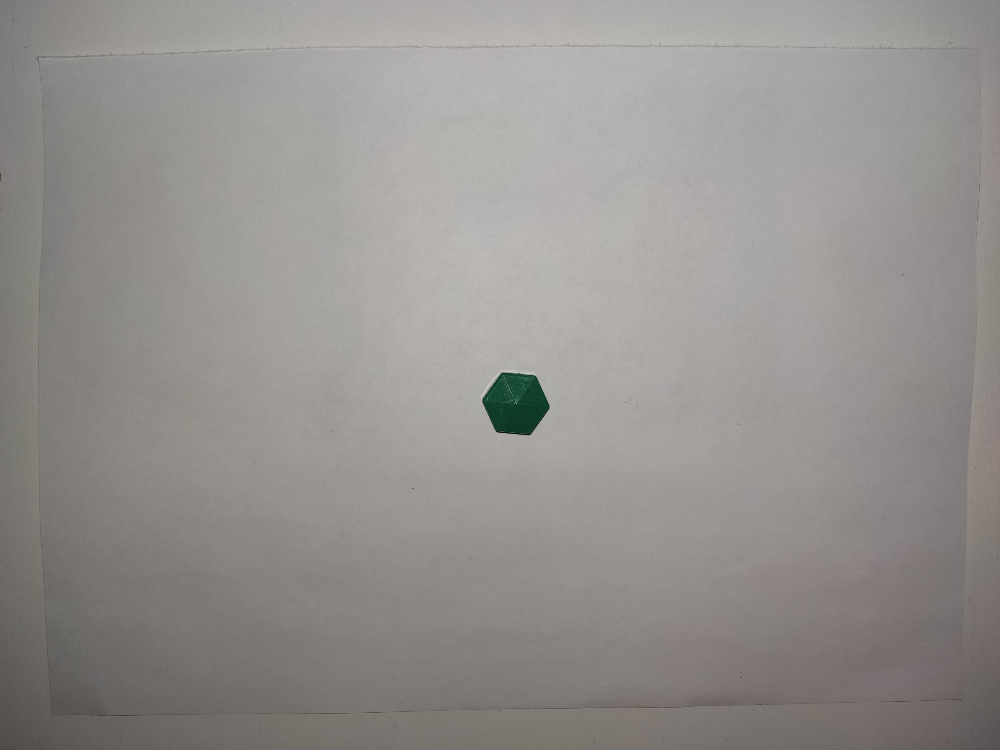
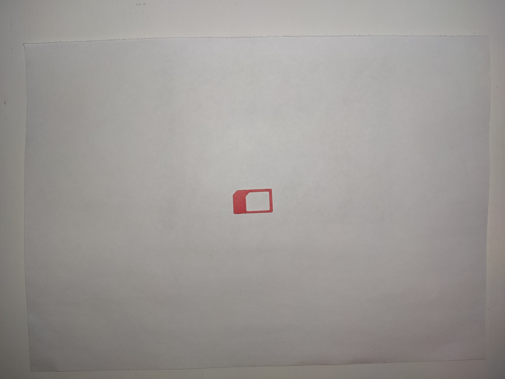
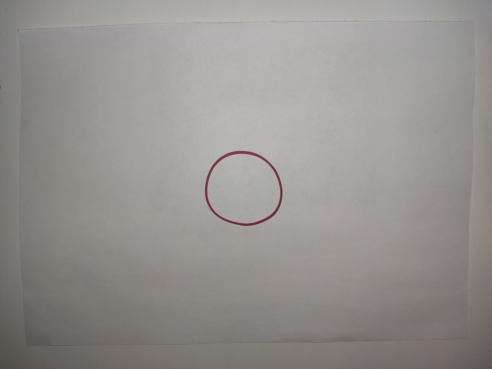
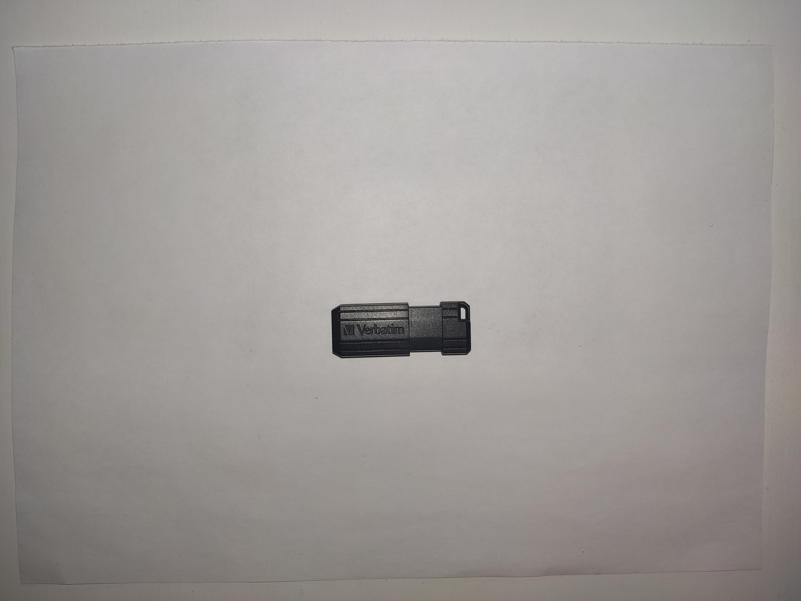
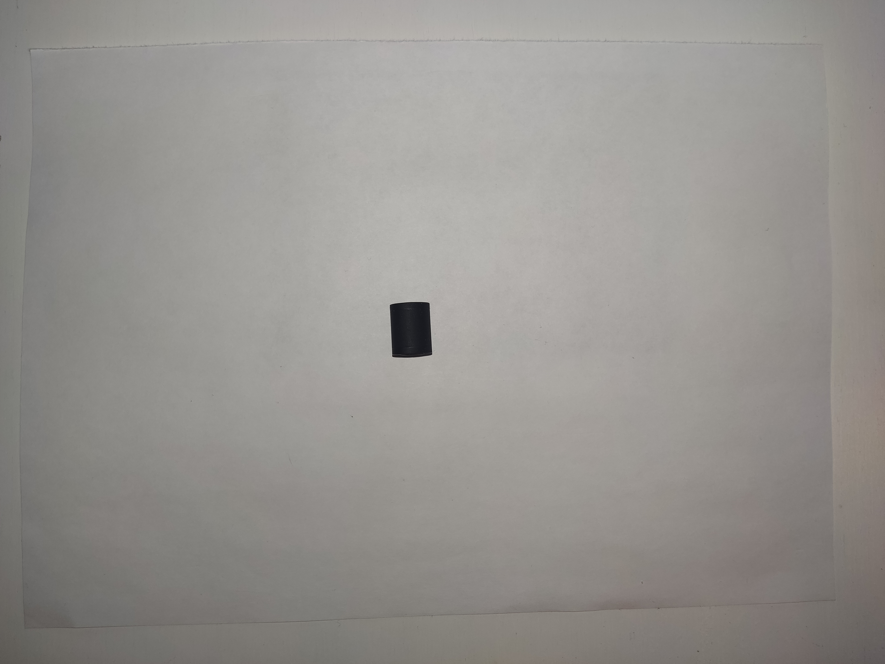
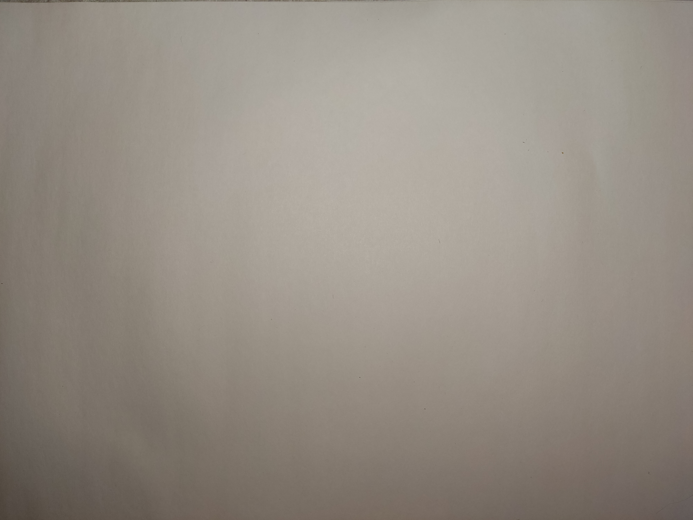
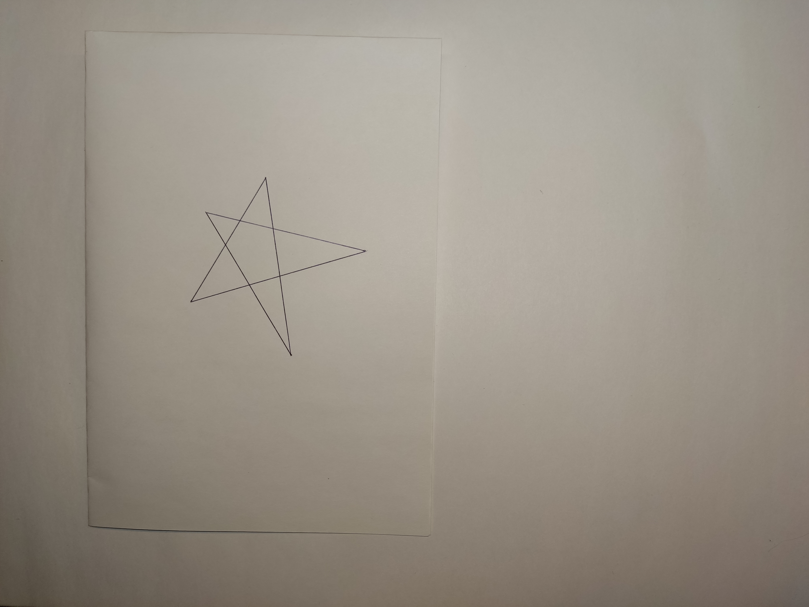
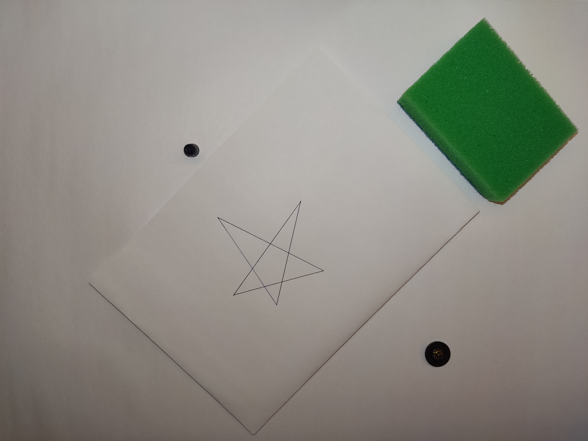

# Постановка задачи

На вход подается изображение, на котором расположены заранее известные предметы и начерченный на белом листе бумаги многоугольник. 

Необходимо расположить максимальное количество изображенных предметов в начерченный многоугольник. Если максимальное количество достигается с различным набором предметов, следует выбрать тот набор, на котором достигается наибольшая площадь покрытия начерченного многоугольника.

На выходе возвращается набор вмещенных предметов и отношение непокрытой площади многоугольника к площади всего многоугольника.

---

# Требования к входным данным

## Общие

 * Тень [почти] отсутствует
 * Высота съемки 40-60см над горизонтальной поверхностью
 * Камера отклоняется от нормали к горизонтальной поверхности не более чем на 5°
 * Все предметы полностью помещаются на изображении
 * Формат: .jpg
 * Разрешение: 4000x3000

## Изображения предметов

 * Расположен на белом листе A4 в центре
 * Лист лежит на горизонтальной поверхности, фон которой близок к белому
 * Лист помещается на изображении с краями
 * Предмет на листе единственен
 * Границы предмета четко различимы на белом листе A4

## Изображения предметов с многоугольником

 * Многоугольник замкнутый, может самопересекаться, невырожденный, > 2 вершин
 * Начерчен темным цветом на белой бумаге A5, толщина линии > 1мм в естественной плоскости
 * Многоугольник на листе единственен

<!-- -->

 * Предметы расположены так, чтобы между ними был виден фон
 * Предметы могут находится внутри, но не на другом предмете
 * Может быть несколько одинаковых предметов на одном изображении

<!-- -->

 * Лист с многоугольником и предметы должны не пересекаться

---

# План решения задачи

 1. Выделить многоугольник

    1. Выделить лист, на котором расположен многоугольник

        * Края листа различимы на фоне, поэтому можно выделить углы листа, по которым возможно выделить весь лист

        ИЛИ

         * Использовать преобразование Хафа, чтобы выделить линии; по точкам пересечения выделить лист, размеры которого заранее известны

    2. Выделить многоугольник на листе

        * Многоугольник не отбрасывает тень и нарисован контрастным к белому цветом (хорошо выделяем), можно использовать egde-based сегментацию
        * Многоугольник может самопересекаться. Его нужно разбить на непересекающиеся многоугольники, например, выделяя компоненты связности

 2. Выделить каждый объект из представленных

    * Лист с многоугольником уже выделен, его можно вырезать из изображения
    * Объекты выделимы на фоне, можно использовать бинаризацию  
      Возможные трудности

        * Неточность границ из-за отбрасываемой тени (например, [губка](imgs/items/spounge.jpg))
        * Несуществующие пустоты в объектах из-за засвеченности объекта (например, [шпатель](imgs/items/spatula.jpg))

 3. Пустоты в объектах

    Некоторые объекты ([симка](imgs/items/sim.jpg), [резинка](imgs/items/rubber_band.jpg), [шпатель](imgs/items/spatula.jpg), [флешка](imgs/items/flash_drive.jpg)) имеют в себе пустоты. Разумно попытаться поместить в них другие объекты  

    * По сути, решение данной подзадачи есть сама задача, однако, размеры пустот заранее известны, в отличие от размеров многоугольников. Предлагается не решать эту подзадачу каждый раз, а использовать найденное решение

        * В пустоту как [шпателя](imgs/items/spatula.jpg), так и [флешки](imgs/items/flash_drive.jpg) ничто не помещается
        * В пустоту [симки](imgs/items/sim.jpg) помещается и [шарик](imgs/items/clay.jpg), и [колпачок](imgs/items/cap.jpg) (вместе)
        * В пустоту [резинки](imgs/items/rubber_band.jpg) помещаются любые 3 объекта: [симка](imgs/items/sim.jpg) и\или [колпачок](imgs/items/cap.jpg) и\или [шарик](imgs/items/clay.jpg), [шестиугольник](imgs/items/hexagon.jpg), [колесо](imgs/items/wheel.jpg), [пуговица](imgs/items/button.jpg). Если объекта 4, следует заполнить пустоту предметами максимальной площади

    * Если удалось поместить один объект в пустоту другого, следует сгруппировать помещенные объекты и объект с пустотой, и использовать группу как один объект с пустотой
    * Пустота в объекте не учитывается при вычисление его площади

 4. Расположение объектов внутри многоугольника

    * Сформировать всевозможные комбинации представленных объектов, суммарная площадь которых не превосходит площади многоугольника
    * Для каждой комбинации

        * Каждый объект, чья проекция на плоскость есть круг, поместить в многоугольник так, чтобы объект находился в углу и касался (по возможности) двух сторон многоугольника (круг толерантен к поворотам -- на его размещение влияет только перенос)
        * Остальные предметы следует размещать так: самая длинная сторона объекта располагается по самой длинной стороне многоугольника вплотную, если это невозможно, делается параллельный перенос от стороны. Возможный поворот объекта совершается только вокруг оси, перпендикулярной к поверхности
        * Если объект никак не помещается, берется следующий объект
        * После каждого размещения проверяется связность многоугольника. Многоугольник разбивается на свои компоненты связности: те, которые не способны вместить ни один из оставшихся предметов (по площади), отбрасываются и не участвуют в дальнейших шагах алгоритма

 5. Формирование ответа

    Из всех расположений выбрать максимальное по количеству вмещенных объектов. Если таких наборов несколько, выбрать тот, площадь которого наибольшая

---

# Входные данные

## Предметы

 * Губка

    

 * Шпатель

    

 * Пуговица

    

 * Колпачок от ручки

    

 * Пластилиновый шарик

    

 * Шестиугольник

    

 * Симка

    

 * Резинка

    

 * Флешка

    

 * Колесо

    

 * Фон

    

## Примеры

### Некорректные данные

 * 0 многоугольников на листе, 2 предмета

    

 * Пустой фон

    

 * 0 многоугольников без листа, 3 предмета: 1 внешне похож на многоугольник

    

 * Незамкнутый многоугольник

    

 * 1 многоугольник на листе, 0 предметов

    

 * Пустой лист на фоне

    

 * Предмет, похожий на многоугольник, на листе вместо многоугольника

    

 * Незамкнутый многоугольник, предмет, похожий на многоугольник

    

### Вращения листа с многоугольником

 * Pi / 4

    

* -Pi / 2

    

* 5Pi / 4

    

### Корректные данные

 * 1 многоугольник, 1 помещающийся предмет

    

 * 1 многоугольник, 4 помещающихся предмета

    

 * 1 самопересекающийся многоугольник, 1 помещающийся предмет

    

 * 1 многоугольник, 1 непомещающийся предмет

    

 * 1 многоугольник, 1 непомещающийся предмет с пустотой, в которую помещается многоугольник

    

 * Использование пустот в предметах

    

Другие тестовые данные можно найти в [imgs/input_data](imgs/input_data).

Разметка данных находится в [imgs/input_data/desc.pydict](imgs/input_data/desc.pydict). Формат разметки указан в комментариях (#) в самом файле.
